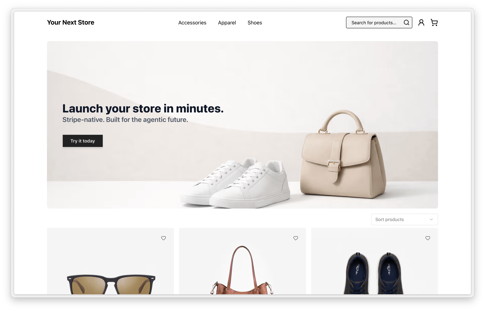

<p align="center">
  <a href="https://yournextstore.com">
    
  </a>
</p>

<h1 align="center">Your Next Store</h1>

<p align="center">
  <strong>Open-source Next.js e-commerce.</strong> 
</p>
<p align="center">
Stripe-native, ultra fast page loads, typed APIs. 
<br/> Built for AI development (Claude, Codex, Cursor).
</p>

<div align="center">
  <a href="https://demo.yournextstore.com">
    
  </a>
  <p><strong>Live Demo:</strong> <a href="https://demo.yournextstore.com">demo.yournextstore.com</a></p>
</div>

<div align="center">
  <a href="https://yournextstore.com/discord"></a>
  <a href="https://vercel.com/new/clone?repository-url=https%3A%2F%2Fgithub.com%2Fyournextstore%2Fyournextstore&env=ENABLE_EXPERIMENTAL_COREPACK,YNS_API_KEY&envDescription=Read%20more%20about%20required%20env%20variables%20in%20YNS&envLink=https%3A%2F%2Fgithub.com%2Fyournextstore%2Fyournextstore%2Ftree%2Fupcoming%3Ftab%3Dreadme-ov-file%23add-environmental-variables&project-name=yournextstore&repository-name=yournextstore&demo-title=Your%20Next%20Store&demo-description=A%20Next.js%20boilerplate%20for%20building%20your%20online%20store%20instantly%3A%20simple%2C%20quick%2C%20powerful.&demo-url=https%3A%2F%2Fdemo.yournextstore.com%2F&demo-image=https%3A%2F%2Fyournextstore.com%2Fdemo.png"></a>
  <a href="https://www.producthunt.com/posts/your-next-store"></a>
</div>

<br/>

| | |
|:---|:---|
| **AI-Friendly Codebase** | Consistent patterns, typed APIs |
| **Blazing Fast** | Next.js 16, React Compiler, edge caching |
| **Stripe-Native** | Direct API integration, no plugins |
| **Open Source** | self-host storefront anywhere |

## Quick Start

```bash
git clone https://github.com/yournextstore/yournextstore.git
cd yournextstore && bun install
cp .env.example .env.local   # Add your YNS_API_KEY from yns.app/admin
bun dev
```

Open [localhost:3000](http://localhost:3000) — your store is running.

## Why AI Coding Tools Work Better Here

| | |
|---|---|
| **Familiar patterns** | Idiomatic Next.js App Router code (Server Components, Server Actions, `"use cache"`) matches what LLMs have seen thousands of times. Less guessing, more accurate suggestions. |
| **Typed APIs** | Commerce Kit SDK methods like `productBrowse()` and `cartUpsert()` have defined input/output shapes. LLMs write correct code when they know the contracts. |
| **Bounded domain** | Commerce is well-defined: products, variants, carts, checkout. The data models already exist with clear types - no need for the LLM to invent them. |

---

## Tech Stack

- **Next.js 16** – App Router, React Server Components, React Compiler
- **Bun** – Fast JavaScript runtime and package manager
- **Commerce Kit SDK** – Headless commerce API integration
- **Tailwind CSS v4** – Modern utility-first styling
- **Shadcn UI** – Accessible component library with Radix UI primitives
- **Biome** – Lightning-fast linter and formatter
- **TypeScript** – Type-safe development

## Prerequisites

- [Node.js 20+](https://nodejs.org/) (works on 18, 20, 22)
- [Bun 1.0+](https://bun.sh/) (compatible with npm/yarn)
- YNS API key from [yns.app/admin](https://yns.app/admin)

### Environment Variables

Copy `.env.example` to `.env.local` and set:

- `YNS_API_KEY` – Your API token from the admin panel

## Next steps

Refer to the documentation found at [yns.app/admin/api/endpoints](https://yns.app/admin/api/endpoints) for more information on how to fetch products or create carts in your store.
